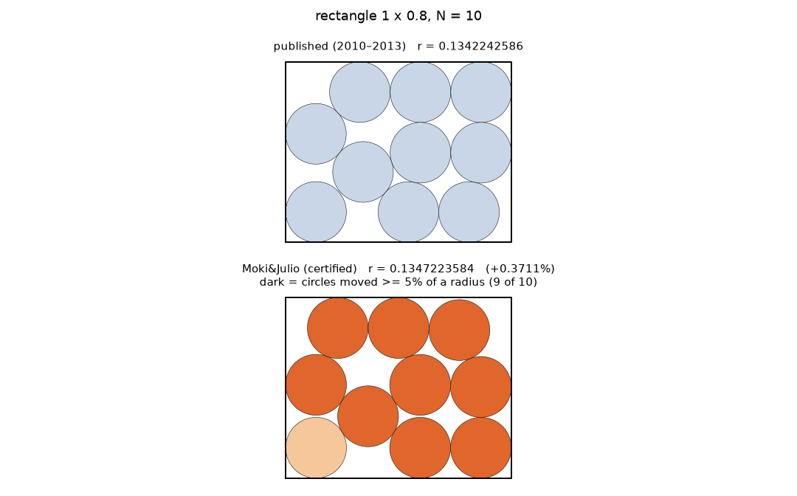
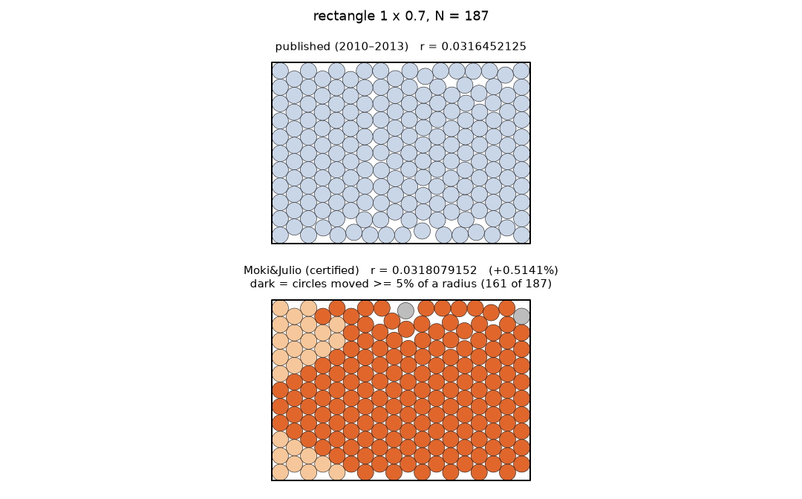

# Moki&Julio — 5,993 new best-known packings of equal circles, spheres and hyperspheres

**5,993 packings of equal circles, spheres and hyperspheres that beat the best-known records** listed on
[Packomania](https://www.packomania.com/) (E. Specht's record tables), in twenty containers: ten whose tables had not changed since 2010–2013, the semicircle (untouched from April 2011 until
September 2026), the square (from v1.6), whose large-N entries are Specht's own lattice packings, the regular pentagon
(from v2.1; its table was last updated in March 2023), the regular 16-gon and 15-gon (from v2.2; tables last updated in
March 2023 and December 2020), equal spheres in a cube (from v2.3, the first three-dimensional table; last updated in June
2013, three cells in June 2018), equal balls in the unit ball of dimension 4, 5 and 6 (from v2.4; tables last updated in
July–August 2025) and — from v2.5 — equal spheres in a sphere (table last updated in July 2026). Every packing is supplied with an exact certificate and is verified by **two independently written exact checkers**
(pure rational arithmetic, no floating point in any decision).

| Packomania table | container | new records | largest gain in radius |
|---|---|---|---|
| `crt` | isosceles right triangle, legs 1 | 143 | +0.055 % (N = 79) |
| `ccq` | circular quadrant, radius 1 | 445 | +0.098 % (N = 500) |
| `crc_100` | rectangle 1 × 0.1 | 10 | +0.030 % (N = 169) |
| `crc_200` | rectangle 1 × 0.2 | 144 | +0.166 % (N = 338) |
| `crc_300` | rectangle 1 × 0.3 | 142 | +0.224 % (N = 287) |
| `crc_400` | rectangle 1 × 0.4 | 179 | +0.293 % (N = 276) |
| `crc_500` | rectangle 1 × 0.5 | 171 | +0.193 % (N = 69) |
| `crc_600` | rectangle 1 × 0.6 | 190 | +0.687 % (N = 219) |
| `crc_700` | rectangle 1 × 0.7 | 325 | +0.752 % (N = 286) |
| `crc_800` | rectangle 1 × 0.8 | 295 | +0.427 % (N = 241) |
| `csc` | semicircle, radius 1 | 82 | +0.078 % (N = 222) |
| `csq` | square, side 1 | 2190 | +6.709 % (N = 7612) |
| `cpt` | regular pentagon, circumradius 1 | 85 | +0.031 % (N = 187) |
| `cxd` | regular 16-gon, circumradius 1 | 66 | +0.066 % (N = 148) |
| `cpd` | regular 15-gon, circumradius 1 | 30 | +0.156 % (N = 112) |
| `scu` | cube, side 1 (spheres) | 455 | +1.255 % (N = 937) |
| `ssp` | sphere, radius 1 (spheres) | 567 | +0.009 % over the bar (N = 917) |
| `hsp4` | ball, radius 1, 4-D (4-D balls) | 220 | +0.017 % over the bar (N = 67) |
| `hsp5` | ball, radius 1, 5-D (5-D balls) | 177 | +0.064 % over the bar (N = 293) |
| `hsp6` | ball, radius 1, 6-D (6-D balls) | 77 | +0.011 % over the bar (N = 152) |
| **total** | | **5,993** | |

Per-N radii (30 digits, old and new) are in [`RESULTS_TABLE.md`](RESULTS_TABLE.md); one row per record in
[`MANIFEST.csv`](MANIFEST.csv) (published radius, new radius, relative gain, kind, precision).



## What's new in version 2.5 (2026-09-26)

- **5,993 records** in **twenty** tables (version 2.4 listed 5,421): **567 records for equal spheres in a
  sphere** (table 20) and 5 more sizes in the ball tables of dimension 4–6 (`hsp5` +1, `hsp6` +4; now
  220 / 177 / 77);
  690 records improved by our own larger packings (below).
- **Table 20 — equal spheres in a sphere (`ssp`, Packomania page last updated July 2026):** **567 records**, N = 144–1000
  (435 at N = 401–1000, 132 at N = 101–400). The cells we beat were held by: Specht's own program 537; Zhou, Ren, He, Liu & Li 27; Lai et al. 3. Gains over the bar are
  small: median +7.9e-07 %, 68 by more than one part in 10⁶; largest N = 917 +0.009 %, N = 918 +0.0087 %, N = 412 +0.0049 %, N = 709 +0.0045 %. Compared with
  Packomania's packing: 476 refinement; 80 unclear (alignment); 8 new arrangement; 3 small (unclear).
- **How (spheres in a sphere):** the ball solver of version 2.4 in three dimensions (`solver/hsp/`, `solver/ssp/`): Packomania's packing
  → sequential-LP polish → basin hopping; exact certification by the same two checkers with d = 3 (`checkers/certify_ball.py`,
  `checkers/verify_exact_ball.py`). Packomania serves its `ssp` coordinate files with the last centre's row left blank (N − 1 centres);
  that centre was rebuilt (`solver/ssp/missing.py`) to use Packomania's packing as a seed and to audit the table.
- **Claim policy (spheres in a sphere):** a record must beat, by more than one part in 10¹⁰ (and the printed radius by more than
  2 × 10⁻¹²), the largest of Packomania's printed radius, **Zhou, Ren, He, Liu & Li**, Computers & Operations Research 164 (2024)
  106522 (their tables for N ≤ 400, arXiv 2305.10023, read at their most favourable rounding; they are the bar at 1 of our sizes),
  Cohn's spherical codes in 3-D (alone or with a centre sphere) and the printed radius of any larger N. Huang & Yu (2012, N ≤ 72) were
  checked at data level too; no published value we found is above Packomania's. For every claimed size, Packomania's packing (its
  N − 1 served centres plus the rebuilt one) was checked exactly: its true minimum radius lies within 3 × 10⁻¹² of the printed radius
  (0 mismatches). Local optimality is not attempted in 3-D.
- **Our own envelope.** A packing of M circles minus M − N of them is a packing of N with the same radius. In version 2.4, 690 of
  our records were beaten that way by our own record for a larger N (`crc_800` 1, `csq` 688, `scu` 1): each is now that
  packing with the extra circles removed (265 of them then polished with the square's SLP solver, `solver/slp_big.py`, into the space the removed circles left),
  certified again by both checkers; median gain +0.0052 %, largest +0.356 %.
- **The other tables:** no new sizes; no further improvements. 1,340 records are
  certified locally optimal. Every result passed both exact checkers, the prior-art gate and the table-radius gate again from scratch;
  no version 2.4 record was withdrawn.
- **Tables re-checked:** on 2026-09-26 every radius on Packomania's twenty live pages used here (10,412 rows) still equals the
  values these records are compared against.

## What's new in version 2.4 (2026-09-26)

- **5,421 records** in **nineteen** tables (version 2.3 listed 4,952): the first tables in more than three
  dimensions, **469 records for equal balls in a ball** in dimension 4, 5 and 6.
- **Table — equal balls in the unit ball of dimension 4 (`hsp4`, Packomania page last updated July 2025):** **220 records**, N = 57–300. Largest gains in radius over the bar (our own margin): N = 67 +0.017 %, N = 71 +0.013 %, N = 160 +0.0085 %, N = 139 +0.0077 %; median +8.6e-05 %; 2 gain more than 0.01 %.
  Compared with Packomania's own packing: 108 refinement; 104 unclear (alignment); 6 new arrangement; 2 small (unclear). At 1 size the bar was a spherical-code construction, not the table entry: there the gain over Packomania's printed radius (MANIFEST.csv) is mostly the code's (e.g. N = 120: +2.3e-08 % over Packomania, of which +2.2e-08 % over the code is ours).
- **Table — equal balls in the unit ball of dimension 5 (`hsp5`, Packomania page last updated August 2025):** **176 records**, N = 86–300. Largest gains in radius over the bar (our own margin): N = 293 +0.064 %, N = 207 +0.034 %, N = 299 +0.012 %, N = 273 +0.0074 %; median +0.00011 %; 3 gain more than 0.01 %.
  Compared with Packomania's packing as recovered from its 4-column file (see below): 93 refinement; 82 unclear (alignment); 1 new arrangement. At 5 sizes the bar was a spherical-code construction, not the table entry: there the gain over Packomania's printed radius (MANIFEST.csv) is mostly the code's (e.g. N = 96: +0.192 % over Packomania, of which +2.1e-08 % over the code is ours).
- **Table — equal balls in the unit ball of dimension 6 (`hsp6`, Packomania page last updated July 2025):** **73 records**, N = 62–250. Largest gains in radius over the bar (our own margin): N = 146 +0.0076 %, N = 132 +0.0073 %, N = 169 +0.0065 %, N = 170 +0.0062 %; median +0.00032 %.
  Compared with Packomania's packing as recovered from its 4-column file (see below): 50 unclear (alignment); 23 refinement. At 30 sizes the bar was a spherical-code construction, not the table entry: there the gain over Packomania's printed radius (MANIFEST.csv) is mostly the code's (e.g. N = 198: +0.467 % over Packomania, of which +0.0008 % over the code is ours).
- **Recovering Packomania's 5-D and 6-D packings.** Packomania serves its hsp5 and hsp6 coordinate files with only the first
  four coordinates of every centre. The missing ones are pinned by the geometry. In 5-D a ball touching the wall has
  |x₅| = √((1 − r)² − x₁² − … − x₄²), and every close pair forces an order on the x₅ line: one mixed-integer program (HiGHS: a sign
  per ball, an "interior" flag per ball, an order per close pair, fewest interior balls) completes every one of the 299 hsp5 files
  into a valid packing at its printed radius (249 files exactly; 50 within 10⁻⁶ relative, the files' 12-decimal rounding)
  (`solver/hsp/recon56.py`). In 6-D the missing pair (x₅, x₆) of a jammed ball lies where at least three circles meet — its wall
  circle and the contact circles around neighbours already placed — which almost never happens by chance; growing the packing
  ball by ball from such triple points recovers all 249 hsp6 files at their printed radius (`solver/hsp/recover6.py`). These
  recovered packings are Specht's; they are the starting points of our hsp5 and hsp6 records. On all 299 recovered hsp5 packings
  the two checkers below agree on every one of 1,495 verdicts, including planted overlaps and wall violations.
- **How (balls):** start from Packomania's packing (published for hsp4, recovered for hsp5 and hsp6) or from a spherical code of
  Cohn's table with a ball at the centre, polish it with a sequential-LP solver in d dimensions
  (`solver/hsp/slpd.py`, the cube solver's LP with the same safeguards against stalling), then basin hopping (relocate / shake moves,
  each followed by the polish) and seeds built from our own packings for nearby N. Then exact certification by two independently
  written checkers, `checkers/certify_ball.py` (checker A) and `checkers/verify_exact_ball.py` (checker B): the wall test
  |c|² ≤ (1 − r)² and every pair test |cᵢ − cⱼ|² ≥ (2r)² are exact integer comparisons; no rounding anywhere. Frame: the unit ball
  centred at the origin — the frame of Packomania's own `hsp` files.
- **Claim policy (balls):** a record must beat, by more than one part in 10¹⁰ (and the printed radius by more than 2 × 10⁻¹²), the
  largest of Packomania's printed radius, the best construction from **Cohn's Table of Spherical Codes** (spherical-codes.org; the
  codes are by the contributors listed there — M ≥ N points on the sphere |c| = 1 − r, or M ≥ N − 1 points plus a ball at the centre;
  the table's rounded cosines are read at their most favourable value) and the printed radius of any larger N. Those code
  constructions already beat Packomania's entry at 4 hsp4, 59 hsp5 and 114 hsp6 sizes; they are
  Cohn's table's results, not ours, and none of them is claimed here. A prior-art check (September 2026) found no other published radius above Packomania's for these
  tables: the public zerothesis.com hypersphere challenges (scored at twelve sizes N ≤ 100 in each dimension) list no
  entry above it, and no paper or dataset of 2024–2026 that we found treats equal balls in a 4-, 5- or 6-dimensional
  ball; one older paper (Stoyan & Yaskov, J. Global Optim. 52, 2012, maximal counts at a fixed ratio) is paywalled and
  was not checked.
  Packomania's own files were checked exactly for every claimed hsp4 size (the true minimum radius of each 12-decimal file lies within
  3 × 10⁻¹² of the printed radius; 0 mismatches); for every claimed hsp5 and hsp6 size the recovered packing keeps the file's four
  published columns and reaches the printed radius to within 10⁻⁶ relative, and the page, the radius list and the file's first line
  agree. Local optimality is not attempted for the balls.
- **The other tables:** no new sizes; no further improvements. 1,339 records are
  certified locally optimal. Every result passed both exact checkers, the prior-art gate and the table-radius gate again from scratch;
  no version 2.3 record was withdrawn.
- **Tables re-checked:** on 2026-09-26 every radius on Packomania's nineteen live pages used here (9,412 rows) still
  equals the values these records are compared against.

## What's new in version 2.3 (2026-09-25)

- **4,952 records** in **sixteen** tables (version 2.2 listed 4,666; see the correction below): the first
  three-dimensional table, **455 records for equal spheres in a cube**.
- **Correction — 169 records of version 2.2 withdrawn** after a literature audit of every table (details below):
  142 square sizes against Basurto et al. (same N), 10 square sizes where their packing for a slightly
  larger N minus one or two circles is already as good (674, 782, 877, 919, 920, 928, 929, 931, 935, 936), 3 square
  sizes below Amore & Morales' N = 3000 packing minus circles (2987, 2989, 2996), rectangle 1 × 0.4 N = 120
  (Amore, de la Cruz, Hernandez, Rincon & Zarate, Phys. Fluids 35, 127112 (2023), Zenodo 8332894) and rectangle 1 × 0.8 N = 314 (it
  equals Packomania's own N = 315 packing minus one circle); and, conservatively, the 12 rectangle records at N = 79, 87 and 99
  (all eight rectangle tables): Lin, Lai & Wang (CAC 2023, doi 10.1109/CAC59555.2023.10450196) report improved packings of
  "25 of 51 benchmark instances" in a fixed rectangle and show N = 79, 87 and 99, but neither the table nor the radii are public
  (the rule we have applied to López & Beasley since version 1.0). The remaining instances are unknown: our rectangle records at
  N = 50–100 carry that residual exposure until the paper's values can be checked. Every table's gate now also compares with every larger published size
  (a packing of M circles minus M − N circles is a packing of N), which only the square's gate did before. 54 of the
  withdrawn records had a local-optimality certificate.
- **Square, details.** Basurto, Gurin, Varga & Odriozola, *Densest packings and
  accelerated equilibration of hard body systems via out-of-equilibrium replica exchange Monte Carlo method*, Computer Physics
  Communications 320, 109990 (2026), published better packings of equal circles in a square for 138 of these sizes, and
  packings equal to ours to within one part in 10⁹ (the same packing) for the other 4 (N = 426, 437, 514, 612)
  (their supplementary materials 3 and 4; the values are not listed on Packomania). Our literature gate had missed the paper; the
  first correction notice posted on version 2.2 counted the 138 beaten sizes only. Withdrawn sizes (all in N = 405–999):
  405, 416, 420, 423, 426, 428, 429, 432, 433, 434, 437, 442, 446, 447, 452, 454, 455, 457, 465, 466, 467, 470, 471, 475, 488, 494, 495, 496, 498, 499, 501, 503, 507, 508, 509, 510, 511, 514, 518, 520, 524, 526, 527, 529, 530, 532, 533, 534, 535, 536, 537, 540, 541, 542, 543, 544, 547, 550, 553, 554, 555, 556, 557, 559, 563, 564, 565, 568, 569, 570, 571, 573, 575, 576, 577, 579, 580, 581, 589, 590, 591, 592, 594, 600, 604, 610, 612, 615, 619, 622, 623, 624, 625, 628, 630, 631, 634, 637, 641, 642, 644, 647, 648, 649, 650, 675, 676, 677, 678, 680, 731, 732, 733, 783, 784, 785, 840, 842, 844, 883, 888, 889, 890, 902, 909, 912, 930, 943, 944, 945, 946, 947, 953, 954, 955, 956, 958, 990, 991, 992, 998, 999. 41 of them had a local-optimality certificate. The square's claim gate now
  includes that paper (its per-N radii, printed to 16 significant digits; a record must beat it by more than one part in 10⁹, anything
  closer counts as the same packing); 13 square records at sizes the paper covers still beat it. Every table's
  literature gate was re-audited against the published data of 2019–2026 papers before this version.
- **Table 16 — equal spheres in a cube (`scu`, Packomania page last updated 25-Jun-2013):** **455 records**, N = 95–978
  (418 at N = 201–1008, 37 at N = 94–200). Largest gains in radius: N = 937 +1.255 %, N = 938 +1.023 %, N = 939 +0.956 %, N = 787 +0.783 %; median +0.00047 %; 96 gain more
  than 0.01 %. The largest gains are at sizes whose table entry is a lattice packing with spheres removed (for example N = 937 is the
  N = 1008 lattice minus 71 spheres).
- **How (cube):** start from Packomania's published packing (or, at N = 94–200, the better of it and the published packing of Lai,
  Hao, Xiao & Glover, INFORMS J. Computing 35(4), 2023), polish it with the sequential-LP solver (`solver/scu/slp3d.py`: interior-point
  LP, scaled step variables and a tiny random tightening of every row, because Packomania's packings have so many exact contacts that
  the plain LP stalls), then seeds built from our own packings for nearby N (delete or insert one to eight spheres) and basin hopping.
  Then exact certification by two independently written checkers, `checkers/certify_cube.py` (checker A) and
  `checkers/verify_exact_cube.py` (checker B): walls are exact rational bounds and every pair is an exact integer test; no rounding
  anywhere. Frame: cube of side 1 centred at the origin — the frame of Packomania's own `scu` files.
- **Claim policy (cube):** a record must beat the largest of Packomania's radius (from the page itself: its radius list and eight
  coordinate files are older than the page), the Lai et al. (2023) radius at N = 94–200, a public N = 203 result (GitHub, September
  2026) and any larger N's radius on the page, by more than one part in 10¹⁰, and the printed radius by more than 2 × 10⁻¹². 31 cube
  records are bounded by Lai et al. For every claimed size, Packomania's own coordinate file was checked exactly to be a valid packing at
  the page's radius (the stale files at their own radius): 0 mismatches. Local optimality is not attempted for the cube.
- **The other tables:** no new sizes; no further improvements. 1,339 records are
  certified locally optimal. Every result passed both exact checkers, the prior-art gate and the table-radius gate again from scratch.
- **Tables re-checked:** on 2026-09-25 every radius on Packomania's sixteen live pages (8,562 rows) still equals the
  values these records are compared against.

## What's new in version 2.2 (2026-09-25)

- **4,666 records** (v2.1: 4,534) in **fifteen** tables: **132 more sizes where we had no record before** and
  **251 records improved further** (largest: `crc_300` N = 197 +0.060 %, `crc_300` N = 235 +0.054 %, `csq` N = 724 +0.028 %, `crc_300` N = 227 +0.027 %).
- **Tables 14 and 15 — the regular 16-gon (`cxd`) and 15-gon (`cpd`):** 96 records.
- **The regular 16-gon (`cxd`, Packomania page last updated 07-Mar-2023):** **66 records**, N = 55–199. Largest gains in radius: N = 148 +0.066 %, N = 146 +0.041 %, N = 138 +0.039 %, N = 131 +0.033 %; median +0.0019 %. At 1 of these sizes a published packing (Amore 2023 or Lai, Hao, Yue & Zhou 2025) is better than the page's, and the record beats that one. Against the page's own packing: 55 new arrangements, 4 refinements, 7 small gains.
- **The regular 15-gon (`cpd`, Packomania page last updated 14-Dec-2020):** **30 records**, N = 53–122. Largest gains in radius: N = 112 +0.156 %, N = 69 +0.124 %, N = 113 +0.107 %, N = 106 +0.064 %; median +0.0081 %. At 15 of these sizes a published packing (Amore 2023) is better than the page's, and the record beats that one. Against the page's own packing: 29 new arrangements, 0 refinements, 1 small gain.
- **How (15- and 16-gon):** start from the better of Packomania's published packing and Amore's published packing for the same N
  (23 records started from Amore's), polish it with the sequential-LP solver, then basin
  hopping (move the least-held circles into the largest holes, or shake a region) with a polish after every move
  (`solver/kgon/search.py`, float arithmetic). Then exact certification by two independently written checkers,
  `checkers/certify_kgon.py` (checker A) and `checkers/verify_exact_kgon.py` (checker B). The walls of a regular k-gon have
  irrational normals and distance; both checkers bound every wall slack with rigorous rational enclosures (π by Machin's formula,
  cosine and sine by Taylor polynomials with explicit remainder bounds) and raise the precision until the sign is proved. A slack
  still undecided at about 10⁻²⁰⁰ counts as a failure, so neither can accept an invalid packing; pairs are exact integer tests.
  Frame: circumradius 1, centred at the origin, one side horizontal at the bottom (the 16-gon therefore also has a horizontal top
  side; the 15-gon has a vertex at (0, 1)) — the frame of Packomania's own `cxd` and `cpd` files.
- **Claim policy (15- and 16-gon):** a record must beat the largest of Packomania's printed radius, Amore's radius for the same N
  (P. Amore, *Circle packing in regular polygons*, Phys. Fluids 35, 027130 (2023); radius recomputed from his published
  coordinates, Zenodo record 7574070) and, for the 16-gon at N = 151–200, the value in Table 9 of Lai, Hao, Yue & Zhou,
  Computers & Operations Research (2025), by more than one part in 10¹⁰, and the printed radius by more than 2 × 10⁻¹² (it is
  printed to 12 decimals). Every record beats that bar by at least 3.0e-09 (relative). For every
  claimed size, Packomania's printed radius was re-derived from its own coordinate file in this frame and its mirror images, and
  the file was checked exactly to be a valid packing at the printed radius minus 2 × 10⁻¹²: 0 mismatches. Local optimality is not
  attempted for the polygons; no polygon packing is claimed locally optimal.
- **The square (`csq`) and the pentagon (`cpt`):** 2,345 square records (v2.1: 2,313) and 85 pentagon records
  (v2.1: 81); new sizes elsewhere: `cpt` 4, `csq` 32; improved further:
  `ccq` 78, `cpt` 1, `crc_200` 3, `crc_300` 13, `crc_400` 8, `crc_500` 3, `crc_600` 10, `crc_700` 8, `crc_800` 12, `csc` 5, `csq` 110. Every result passed both exact checkers, the prior-art
  gate and the table-radius gate again from scratch.
- **Tables re-checked:** on 2026-09-25 every radius on Packomania's fifteen live pages (7,428 rows) still equals the
  values these records are compared against.

## What's new in version 2.1 (2026-09-25)

Version 2.0 (below) was built and verified, and is published together with this version.

- **4,534 records** (v2.0: 4,066) in **thirteen** tables: **468 more sizes where we had no record before** and
  **73 records improved further** (largest: `crc_300` N = 244 +0.047 %, `crc_300` N = 145 +0.030 %, `crc_400` N = 268 +0.030 %, `crc_300` N = 240 +0.023 %).
- **A 13th table — the regular pentagon (`cpt`):** **81 records**, N = 79–200, all at sizes whose
  Packomania entry comes from Specht's own program (the page was last updated in March 2023). Largest gains in radius:
  N = 187 +0.031 %, N = 107 +0.022 %, N = 164 +0.017 %, N = 155 +0.013 %; median +0.0013 %. Against the page's own packing:
  68 new arrangements, 5 refinements, 8 small gains.
- **How (pentagon):** start from Packomania's published packing, polish it with the sequential-LP solver, then basin hopping
  (move the least-held circles into the largest holes, or shake a region) with a polish after every move
  (`solver/cpt/search.py`, float arithmetic). Then exact certification by two checkers:
  `checkers/certify_poly.py` (checker A) and `checkers/verify_exact_poly.py` (checker B, written independently without seeing checker A).
  The pentagon's walls have irrational normals and distance, so both decide every wall test exactly in ℚ(√5, √(10 ± 2√5))
  (a sign test, then one squaring): no inner polygon, no radius given away. Frame: circumradius 1, centred at the origin, one
  vertex at (0, 1), bottom side horizontal — the frame of Packomania's own `cpt` files.
- **Claim policy (pentagon):** a record must beat the larger of Packomania's printed radius and Amore's radius for the same N
  (P. Amore, *Circle packing in regular polygons*, Phys. Fluids 35, 027130 (2023), reference [2] of the page; radius recomputed from
  his published coordinates, Zenodo record 7574070) by more than one part in 10¹⁰, and the printed radius by more than 2 × 10⁻¹²
  (it is printed to 12 decimals). At N = 49–200 Amore's packings beat the page nowhere; every pentagon record beats
  both by at least 6.4e-09 (relative). For every claimed size, Packomania's printed radius was re-derived from
  its own coordinate file in this frame and mirrored (x → −x), and the file was checked exactly to be a valid packing at the printed
  radius minus 2 × 10⁻¹²: 0 mismatches. Local optimality is not attempted for the pentagon (`checkers/lopt.py` handles the
  triangle, rectangles, quadrant and semicircle only); no pentagon packing is claimed locally optimal.
- **The square (`csq`):** 2,313 records (v2.0: 1,926; 387 new sizes, 12 improved further), same claim
  policy as v1.6 (above Packomania's monotone envelope and Amore & Morales). The polish and GPU searches of v2.0 continued.
  Every result passed both exact checkers, the prior-art gate and the table-radius gate again from scratch.
- **Tables re-checked:** on 2026-09-25 every radius on Packomania's thirteen live pages (7,106 rows) still equals the
  values these records are compared against.

## What's new in version 2.0 (2026-09-25)

- **4,066 records** (v1.9: 3,528): **538 more sizes where we had no record before**. The square (`csq`) now holds
  1,926 records under the same claim policy as v1.6 (above Packomania's monotone envelope and Amore & Morales).
- **How:** the sweep that polishes larger published packings of the square with circles removed went on over the sizes
  N = 2,001–10,000 (`solver/hats_csq_polish.py`, `solver/slp_big.py`, early stop 2 × 10⁻⁵ above the bar; about three quarters of
  those sizes are done). Where that polish could not rise above the bar, the GPU basin search (`solver/gpu_big.py`) now starts
  from the same trimmed packing, and it succeeds on most of them. The GPU search from Packomania's own packings continued
  (`solver/gpu_mbh.py`).
  Every result passed both exact checkers, the prior-art gate and the table-radius gate again from scratch.
- **Tables re-checked:** on 2026-09-25 every radius on Packomania's twelve live pages (6,906 rows) still equals the
  values these records are compared against.

## What's new in version 1.9 (2026-09-25)

- **3,528 records** (v1.8: 3,037): **491 more sizes where we had no record before**. The square (`csq`) now holds
  1,388 records under the same claim policy as v1.6 (above Packomania's monotone envelope and Amore & Morales).
- **How:** the polish of larger published packings with circles removed was extended from N ≤ 2,000 to the square's sizes up to
  N = 10,000 (`solver/hats_csq_polish.py`, `solver/slp_big.py`). It now stops once a packing is clearly above the bar
  (2 × 10⁻⁵ relative), which makes one size take seconds; the sweep over these sizes continues. The GPU searches from
  Packomania's own packings continued.
  Every result passed both exact checkers, the prior-art gate and the table-radius gate again from scratch.
- **Exact proofs, second checker:** `proofs/exact/verify_proof_exact.py`, written independently without seeing our checker, replays
  both exact optimality proofs from the published files and passes them; it also rejects all 68 corrupted copies made by
  `proofs/exact/mutate_check.py`.
- **Tables re-checked:** on 2026-09-25 every radius on Packomania's twelve live pages (6,906 rows) still equals the
  values these records are compared against.

## What's new in version 1.8 (2026-09-25)

- **3,037 records** (v1.7: 2,832): **205 more sizes where we had no record before** and **26 records
  improved further** (largest: `crc_800` N = 184 +0.074 %, `csq` N = 857 +0.056 %, `csq` N = 862 +0.026 %, `csq` N = 796 +0.022 %). The square (`csq`) now holds
  897 records under the same claim policy as v1.6 (above Packomania's monotone envelope and Amore & Morales).
- **How:** the GPU search now also starts from Packomania's own packing on the square's sizes we did not hold (`solver/gpu_mbh.py`
  up to N = 1000; the neighbour-list version `solver/gpu_big.py` above), and packings of larger published sizes with circles
  removed were polished up to N = 10,000 (`solver/hats_csq_polish.py`). From N = 1,500 the polish solves its linear programs with an
  interior-point method (`solver/slp_big.py`); the simplex method it used before ran out of time on the largest sizes.
  Every result passed both exact checkers, the prior-art gate and the table-radius gate again from scratch.
- **Tables re-checked:** on 2026-09-25 every radius on Packomania's twelve live pages (6,906 rows) still equals the
  values these records are compared against.

## What's new in version 1.7 (2026-09-25)

- **2,832 records** (v1.6: 2,766): **66 more sizes where we had no record before** and **258 records
  improved further** (largest: `csq` N = 1610 +0.279 %, `crc_800` N = 191 +0.271 %, `crc_700` N = 129 +0.197 %, `crc_800` N = 190 +0.175 %). The square (`csq`) now holds
  692 records under the same claim policy as v1.6 (above Packomania's monotone envelope and Amore & Morales).
- **How:** the GPU batch search (`solver/gpu_mbh.py`) ran over every table (for the square's large sizes a neighbour-list version,
  `solver/gpu_big.py`), and every new record's neighbours were re-seeded from it (N - 1 / N + 1 transplants,
  `solver/transplant_sweep.py`); wall-row flips finished on the quarter disc and semicircle.
  Every result passed both exact checkers, the prior-art gate and the table-radius gate again from scratch.
- **Two entries proven optimal, exactly (computer-assisted):** 4 circles in the 1 × 0.8 rectangle (`crc_800` N = 4,
  r = 7/20 − √2/10) and 6 circles in the 1 × 0.6 rectangle (`crc_600` N = 6, r = 1/5 − √2/30). Both are optimal, and the optimal
  packing is unique up to mirror images. Packomania lists both radii but does not mark them proven, and we found no earlier proof.
  Method: an exact stress certificate in Q(√2) gives a ball around the known packing that holds no other packing; an exact
  branch-and-bound (engine `proofs/exact/prove_small.py`) shows that every packing with a slightly smaller radius lies in that ball.
  [`PROOFS_EXACT.md`](PROOFS_EXACT.md); replay every step with `python proofs/exact/replay_exact.py` (standard library only,
  shares no code with the prover). Independently reviewed in three adversarial rounds.
- **Tables re-checked:** on 2026-09-25 every radius on Packomania's twelve live pages (6,906 rows) still equals the
  values these records are compared against.

## What's new in version 1.6 (2026-09-24)

- **A twelfth table: Packomania's square (`csq`), 630 records** (N = 511–9996; largest gain +6.592 % at
  N = 7965). **Total: 2,766 records** (v1.5: 2,115); in the eleven earlier tables, 21 more sizes and
  320 records improved further.
- **The square's large-N entries.** Most of Packomania's square entries above N ≈ 500 are E. Specht's own regular lattice packings
  (his 2010 note: "many of them can be improved"); the table is also sparse and not monotone in N. Amore & Morales (Discrete Comput.
  Geom. 70 (2023) 249–267) and ZeroThesis (2026) noted that before us; we claim no discovery there.
- **What we claim on the square, and what we don't.** A packing of a larger listed N with circles removed is a packing of N, and
  it is Specht's packing, not ours. So on `csq` we claim a size only if our certified radius beats Packomania's **monotone
  envelope** (the best listed radius at any N' ≥ N), by more than 1e-10 relative and 2e-12 absolute (the table prints 12
  decimals), and also beats Amore & Morales' published values (1 of our square packing fails one of these tests
  and is not claimed; N = 3000 is theirs). Sources of the 630: 319 are standard hexagonal row lattices
  (alternating or shifted rows fitted to the square, minus the least-used circles; 54 distinct lattices; row
  lattices of this kind are classical, the table entries are new), 87 are deletion seeds polished above the envelope,
  94 are independent constructions ("stretched" and "mixed" row lattices, `solver/csq_constructions.py`),
  and 130 come from relocation moves and the GPU search on Specht-program entries (N ≤ 1000).
- **Checkers for up to 10,000 circles:** `checkers/certify_big.py` (checker A) and `checkers/verify_exact_big.py` (checker B, written from
  a one-page spec without seeing the other) — both exact integer arithmetic, pairs pruned by a grid of 2r cells whose completeness is
  argued in each file. Local optimality on the square: attempted for N ≤ 1000 only (42 certified locally optimal,
  81 not rigid, 14 undecided; 493 larger ones not attempted).
- **How (all tables):** relocation and wall-row flips, queued weakest-first by a score that compares each record with a known upper
  bound and with its neighbours (in a sealed test the top-ranked fifth hit 1.7 times as often as the rest), a GPU batch search (`solver/gpu_mbh.py`: many perturbed copies relaxed at once, the
  best polished and checked on the CPU), and neighbour transplants.
- **Tables re-checked:** on 2026-09-24 every radius on Packomania's twelve live pages (6,906 rows) still equals the
  values these records are compared against.

## What's new in version 1.5 (2026-09-24)

- **2,115 records** (v1.4: 2,107): **8 more sizes where we had no record before**
  and **176 records improved further** over v1.4 (largest: `crc_700` N = 368 +0.164 %, `crc_600` N = 304 +0.157 %, `crc_700` N = 249 +0.130 %, `crc_700` N = 367 +0.115 %).
  Largest gain over Packomania: `crc_700` N = 286, +0.752 % in radius.
- **How:** second rounds of relocation and row-phase flips on every size improved in v1.4; a new move that flips the rows along
  the straight walls of the quarter disc and the semicircle (arm W, which passed its sealed probe first); relocation on the rectangle
  sizes that had never had it; neighbour transplants from every new record (`solver/night_probe.py`, `solver/transplant_sweep.py`).
- **Free consistency checks** (`solver/hats_zero.py`, no search): a packing of N + k circles minus k circles is a packing of N,
  and two rectangle packings stacked (or one mirrored across its long side) make a taller one. Run on every table, this arithmetic
  found sizes where our own records implied a better one, e.g. `crc_800` N = 282 = our `crc_400` N = 141 record plus its mirror
  image (+0.299 % over Packomania). Every such seed then went through the same exact chain (`solver/hats_seeds.py`).
- **Molnár's "teeth"** (Z. Füredi, Discrete Comput. Geom. 6 (1991), Example 1.1, credited there to Molnár) give a record at
  `crc_100` N = 83 (+0.005 %; `solver/teeth_family.py`). The construction is theirs; the table entry is new.
- **Correction:** the upper bound behind our 58 zig-zag optimality proofs is stated by Füredi (1991, pp. 96–97) for any closed
  thin rectangle; [`PROOFS.md`](PROOFS.md) now credits it (v1.0–v1.4 wrongly said we had found no such statement). Two rectangle
  sizes that tie structures in López's thesis (`crc_200` N = 37, `crc_100` N = 39) are now labelled as ties; they stay unclaimed.
- **Tables re-checked:** on 2026-09-24 every radius on Packomania's eleven live pages (3,759 rows) still equals the
  values these records are compared against.

## What's new in version 1.4 (2026-09-24)

- **2,107 records** (v1.3: 2,105): **2 more sizes where we had no record before**
  and **175 records improved further** over v1.3 (largest: `crc_800` N = 107 +0.279 %, `crc_800` N = 141 +0.234 %, `crc_700` N = 368 +0.193 %, `crc_800` N = 157 +0.192 %).
  Largest gain over Packomania: `crc_700` N = 286, +0.752 % in radius.
- **How:** second rounds of the two moves that passed their sealed probes in v1.3 (`solver/night_probe.py`): iterated relocation
  on every size that had just improved, and row-phase flips on the rectangle sizes the first round did not reach and on the
  smaller just-improved ones. Every result passed both exact checkers, the prior-art gate and the table-radius gate again from
  scratch.
- **Tables re-checked:** on 2026-09-24 every radius on Packomania's eleven live pages (3,759 rows) still equals the
  values these records are compared against.

## What's new in version 1.3 (2026-09-24)

- **A new table: the semicircle** (`csc`, unit semicircle, N up to 250). Packomania's table was untouched from April 2011 until ten
  sizes were updated on 9 September 2026 (we do not claim those ten: their coordinates are not published, so the printed radius
  cannot be re-derived). **81 new records**, largest gains N = 222 +0.078 %, N = 233 +0.069 %, N = 227 +0.064 %;
  72 of them certified locally optimal. Checked by checker A and by a new, independently written checker B
  (`checkers/verify_exact_semi.py`). For N = 151–200 we compare against Lai, Hao, Yue & Zhou (2025, Table 8) instead of Packomania:
  35 semicircle packings that beat the website but not that paper (or cannot be checked) are listed as not claimed.
- **2,105 records in total** (v1.2: 1,986). In the ten earlier tables: **38 more
  sizes** and **368 records improved further** over v1.2 (largest: `crc_700` N = 209 +0.443 %, `crc_700` N = 403 +0.390 %, `crc_700` N = 417 +0.368 %, `crc_400` N = 276 +0.291 %).
  Largest gain over Packomania: `crc_700` N = 286, +0.752 % in radius.
- **How:** two new moves, each chosen by a sealed probe before any full run (`solver/night_probe.py`): *iterated relocation* (basin
  hopping whose kick moves one to three of the least-loaded circles into the largest holes) and *row-phase flips*
  (shift a whole lattice row, or everything above a badly stacked row, by one radius, then re-optimise — a collective move
  that single-circle moves cannot make). Plus *exact row lattices* found by our proofs scout: alternating, shifted and square rows
  in closed form, trimmed to N and re-optimised (`solver/fam_sweep.py`); e.g. `crc_700` N = 209, +0.45 % over the published
  radius. The semicircle's first pass (`solver/csc_pass.py`) started from Packomania's own packings and their neighbours. Every
  result passed both exact checkers, the prior-art gate and the table-radius gate from scratch.
- **Tables re-checked:** on 2026-09-24 every radius on Packomania's eleven live pages (3,759 rows) still equals the
  values these records are compared against.

## What's new in version 1.2 (2026-09-24)

- **1,986 records** (v1.1: 1,945): **41 more sizes where we had no record
  before**, and **329 records improved further** over v1.1 (largest: `crc_700` N = 286 +0.752 %, `crc_600` N = 219 +0.665 %, `crc_700` N = 189 +0.585 %, `crc_600` N = 218 +0.402 %).
  Largest gain over Packomania now: `crc_700` N = 286, +0.752 % in radius.
- **How:** the neighbour-transplant sweep was completed over every table (cascading from every new record), with Packomania's
  own neighbouring packings used as a second family of seeds; where one step found nothing, two-step transplants (N − 2 plus two
  circles, N + 2 minus two) and relocating the one or two least-loaded circles into the largest holes (`solver/gen2_probe.py`).
  Every result passed both exact checkers, the prior-art gate and the table-radius gate again from scratch.
- **A proof:** [`PROOFS.md`](PROOFS.md) — for thin rectangles, Füredi's bound (1991; credited from v1.5) shows the zig-zag
  packing is optimal whenever it fits; applied to the tables it proves **58 entries of Packomania's rectangle tables optimal** that were not marked proven (the published values
  there are exactly right). Checked independently; verify with `python proofs/proof_zigzag_check.py`.
- **Tables re-checked:** on 2026-09-24 every radius on Packomania's ten live pages (3,509 rows) still equals the values these records
  are compared against.
- **Possible prior art we could not check:** Lin, Lai & Wang, *Probability-based monotonic basin-hopping algorithm for packing
  equal circles in a rectangular container*, 2023 China Automation Congress, pp. 2602–2606 (doi:10.1109/CAC59555.2023.10450196),
  report better values than the best known for 25 of 51 fixed-rectangle instances. The paper is closed access and the instances
  are not listed in its abstract. Where it overlaps these tables, their values, not Packomania's, are the ones to beat.

## Cumulative since version 1.0 (as of version 1.6)

- **5,993 records** (v1.0: 1,933). **4071 sizes where we had no record before**; **1071 of the v1.0 records improved
  further** (gain over our own v1.0 radius; largest `crc_700` N = 286 +0.752 %, `crc_600` N = 219 +0.667 %, `crc_700` N = 190 +0.592 %, `crc_700` N = 189 +0.585 %, `crc_700` N = 188 +0.559 %). Every file is re-verified from scratch by both
  exact checkers (5993 / 5993), and Packomania's printed radius for every claimed size was re-derived from its own coordinate file in the
  same frame and in mirrored frames (0 mismatches).
- **How:** (1) every certificate driven to its exact local peak in 80-digit arithmetic (a mixed-precision sequential-LP step, then
  Newton on the identified contacts); (2) **neighbour transplants** — seed size N from our packing at N−1 (one circle into the
  largest hole) or N+1 (remove the circle with fewest contacts), then polish; this jumped over weak basins, e.g. `crc_700` N = 187
  from +0.003 % to +0.532 % over the published radius (picture below); (3) a flex walk along load-bearing flexes found by the certificate below.
- **Local optimality certificates** (`local_optimality/<table>.zip`, one JSON per packing: kept constraints and contact forces).
  For **1,340** of the 5,993 packings, two independently written checkers (`checkers/lopt.py`, float-rigorous;
  `checkers/verify_lopt.py`, exact rational in ℚ(√2)) prove: every feasible packing whose load-bearing circles and radius lie
  within an explicit distance ρ of ours (median ρ = 7.1e-09 r) has radius at most ours + Δ (Δ ≤ 3e-22 r in every case,
  median 4e-44 r), and a true local maximum lies within t₀ of ours. In plain words: no small nudge beats these packings.
  Of the other 4,653: 1012 carry a first-order flex (a sliding or buckling motion the first-order theorem cannot
  exclude) and 3641 could not be certified by this method; none of them is claimed locally optimal. Verdict, ρ
  and Δ for every packing: [`LOCAL_OPTIMALITY.csv`](LOCAL_OPTIMALITY.csv). Theorem and proof: docstring of `checkers/lopt.py`.



## Verify it yourself

```
python verify.py
```
Standard library only. It unzips `certificates/`, and for every record runs both checkers against the published radius in
`MANIFEST.csv`. A record counts only if **both** say `IMPROVES`. Expected output: `TOTAL: 5993 / 5993 verified by both checkers`.

- **Certificate format** (`certificates/<table>.zip`, one file per N): first line `r <radius>`, then N lines `x y` (circle centres,
  decimal). Same coordinate frame as Packomania's own files: `crt` has its right angle at the origin and legs along the axes;
  `ccq` is the unit quarter disc at the origin; `crc_k` is width 1 × height 0.k centred at the origin; `csq` is the unit square centred at the origin;
  `cpt`, `cpd` and `cxd` are the regular pentagon, 15-gon and 16-gon with circumradius 1 centred at the origin and a
  horizontal bottom side (the pentagon and 15-gon have a vertex at (0, 1); the 16-gon has a horizontal top side);
  `scu` is the cube of side 1 centred at the origin (lines `x y z`); `ssp` is the unit sphere centred at the origin (lines
  `x y z`); `hsp4`, `hsp5` and `hsp6` are the unit ball of dimension 4, 5 and 6 centred at the origin (lines of 4, 5 or 6
  numbers; Packomania's own naming `hsp4-<N>` for the .pck files).
- **Checker A** (`checkers/certify_circ.py`; for the square `checkers/certify_big.py`; for the pentagon `checkers/certify_poly.py`;
  for the 15- and 16-gon `checkers/certify_kgon.py`; for the cube `checkers/certify_cube.py`; for the spheres in a sphere and
  the balls in 4–6 dimensions `checkers/certify_ball.py`): every circle inside the container, every pair at distance ≥ 2r, all in exact
  fractions (the only irrational terms, √2 on the triangle's hypotenuse and the quadrant's arc, are handled by a sign check and
  squaring). Claim floor: IMPROVES only if the radius exceeds the published one by more than one part in 10¹⁰ — published values can
  be low by ~10⁻²⁴ from last-digit rounding, which is a tie, not a record.
  For the pentagon, `checkers/certify_poly.py` decides every wall exactly in ℚ(√5, √(10 ± 2√5)); for the 15- and 16-gon,
  `checkers/certify_kgon.py` proves every wall with rigorous rational enclosures; the cube's walls are exact rational bounds, and
  the balls' and spheres' wall and pair tests are exact integer comparisons. These say IMPROVES for any gain; the same 10⁻¹⁰
  floor (and the literature gate) is applied when those records are selected.
- **Checker B** (`checkers/verify_exact_crt.py`, `checkers/verify_exact_rect_quad.py`, for the semicircle
  `checkers/verify_exact_semi.py` (two labelled one-line parser fixes), for the square `checkers/verify_exact_big.py`,
  for the pentagon `checkers/verify_exact_poly.py`, for the 15- and 16-gon `checkers/verify_exact_kgon.py`, for the cube
  `checkers/verify_exact_cube.py`, for the spheres and balls `checkers/verify_exact_ball.py`): written independently, blind to checker A.
- `packomania/<table>.zip` holds the same packings in Packomania's submission format (`.pck`: radius, name, coordinates).

## How they were found

Search over the positions of N centres maximising the smallest clearance (circles to walls, circles to each other):
1. **Local solver** — sequential linear programming with a trust region (HiGHS): linearise every near-active distance and wall,
   solve the LP, accept the step only if the true minimum clearance grows (`solver/slp.py`, `solver/slp_circ.py`).
2. **Global search** — monotonic basin hopping (Grosso, Jamali, Locatelli, Schoen): perturb all circles a little or one region a
   lot, re-solve, keep improvements, kick on stagnation; many chains in parallel; seeded with the published record, then with our own
   best (`solver/campaign*.py`, `solver/quickpass.py`, `solver/deeppass.py`).
3. **High precision** — mixed-precision Gauss–Newton on the contact graph to residual < 10⁻⁵⁰; certificates written at 45 digits
   where the refinement converges (`solver/refine*.py`).
4. **Positive controls before any claim** — all published triangle records re-derived from their own coordinates to 10⁻³⁰; the
   search re-found 14 of 14 known small records; both checkers reject planted overlaps, points outside, and inflated radii.

**Kinds of improvement** (our circles matched one-to-one to the published ones; loose "rattler" circles ignored):
4,267 new arrangements (a held circle moved ≥ 5 % of a radius and the gain is ≥ 10⁻⁶), 1045 refinements of the published
arrangement, 358 small gains we do not claim as new structures.

## Prior art we checked — and what we therefore do NOT claim

Packomania is not the only record: two papers improved some of these tables without their results reaching the site.
- **Lai, Hao, Yue & Zhou**, *Computers & Operations Research* 181 (2025) 107099 — better values for N = 151–200 in the triangle and
  the quadrant. Our results there beat the website but **not** the paper (compared at the paper's 8 printed decimals, after checking
  the paper rounds rather than truncates), except **triangle N = 199**, which beats both. The other sizes in that window are
  excluded.
- **López & Beasley**, *EJOR* 214 (2011) 512–525 (and López's thesis, Table 4.5) — improvements on the 5 × 1 and 10 × 1
  rectangles (= `crc_200`, `crc_100`) at 15 values of N whose radii were never published; those N are excluded.
323 packings that beat the website were excluded this way; they are listed at the end of `RESULTS_TABLE.md`.

## Credit, citation, licence

Finders: **Moki&Julio**. Search, certification and both checkers were built with AI assistance. Record tables and published coordinates: E. Specht, packomania.com.
Data (certificates, `.pck` files, tables): **CC BY 4.0** — reuse freely, credit "Moki&Julio". Code: MIT (see `LICENSE`).
Please cite via [`CITATION.cff`](CITATION.cff).
